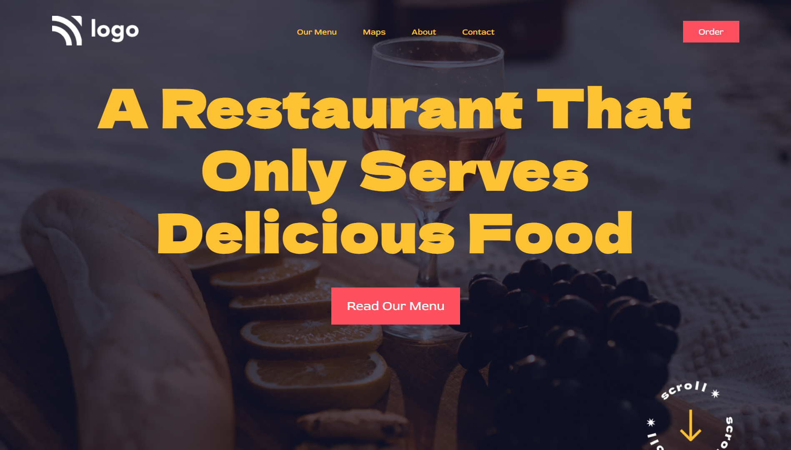

## Hello👋 I'm **Harsh Kunte**
### This is a landing page of a restaurant's website. Made using basic HTML and CSS.

### Things I learnt in this project🤯
- CSS positions
- background opacity
- oject-fit property of image

### This is how it looks 👀

## Go check it out live👉[here](https://restaurant-main.netlify.app/)

It took 3hrs to complete this masterpiece.😮‍💨